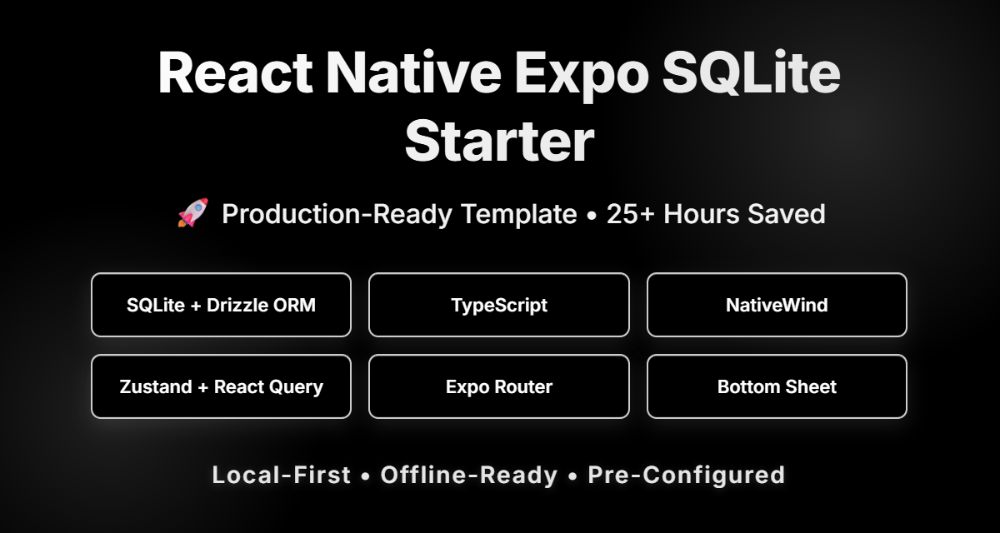
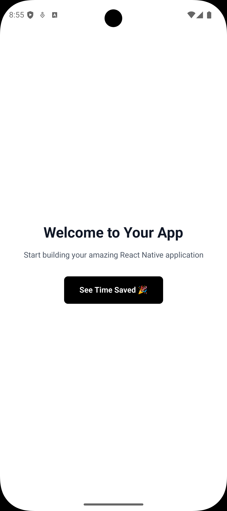
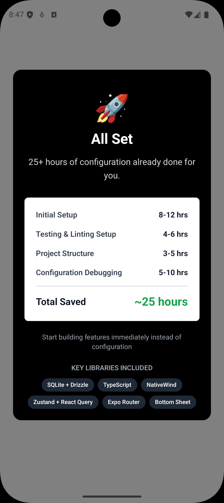

# React Native Expo SQLite Starter Template



A production-ready React Native Expo starter template with SQLite database integration, featuring a modern tech stack with local-first data persistence, state management, testing, and code quality tools pre-configured.

## Screenshots

<div align="center">
  
  
</div>

## Features

- **Expo SDK 54** - Latest Expo framework with React 19
- **Expo Router** - File-based routing for native navigation
- **TypeScript** - Type-safe development
- **NativeWind (Tailwind CSS)** - Utility-first styling for React Native
- **Drizzle ORM** - Type-safe database toolkit with SQLite
- **Zustand** - Lightweight state management
- **React Query** - Powerful data fetching and caching
- **Gorhom Bottom Sheet** - Performant bottom sheet component
- **Jest & Testing Library** - Comprehensive testing setup
- **ESLint & Prettier** - Code quality and formatting
- **Husky & lint-staged** - Pre-commit hooks for code quality
- **Drizzle Studio** - Database visualization and management

## Tech Stack

### Core

- [Expo](https://expo.dev/) - React Native development platform
- [React Native](https://reactnative.dev/) - Mobile framework
- [TypeScript](https://www.typescriptlang.org/) - Type safety

### Navigation & UI

- [Expo Router](https://docs.expo.dev/router/introduction/) - File-based routing
- [NativeWind](https://www.nativewind.dev/) - Tailwind CSS for React Native
- [Gorhom Bottom Sheet](https://gorhom.dev/react-native-bottom-sheet/) - Performant bottom sheet modals
- [React Native Reanimated](https://docs.swmansion.com/react-native-reanimated/) - Smooth animations
- [React Native Gesture Handler](https://docs.swmansion.com/react-native-gesture-handler/) - Touch gestures
- [React Native Safe Area Context](https://github.com/th3rdwave/react-native-safe-area-context) - Safe area handling

### Database

- [Drizzle ORM](https://orm.drizzle.team/) - Type-safe ORM
- [Expo SQLite](https://docs.expo.dev/versions/latest/sdk/sqlite/) - Local database
- [Drizzle Kit](https://orm.drizzle.team/kit-docs/overview) - Database migrations

### State Management

- [Zustand](https://zustand-demo.pmnd.rs/) - State management
- [React Query](https://tanstack.com/query/latest) - Server state management

### Testing

- [Jest](https://jestjs.io/) - Testing framework
- [Testing Library](https://testing-library.com/docs/react-native-testing-library/intro/) - React Native testing utilities

### Code Quality

- [ESLint](https://eslint.org/) - Linting with Expo config
- [Prettier](https://prettier.io/) - Code formatting
- [Husky](https://typicode.github.io/husky/) - Git hooks
- [lint-staged](https://github.com/lint-staged/lint-staged) - Run linters on staged files

## Prerequisites

- [Node.js](https://nodejs.org/) (LTS version recommended)
- [npm](https://www.npmjs.com/) or [yarn](https://yarnpkg.com/)
- [Expo CLI](https://docs.expo.dev/get-started/installation/)
- For iOS: macOS with Xcode
- For Android: Android Studio with SDK

## Getting Started

### 1. Clone or Use This Template

```bash
# Clone the repository
git clone <your-repo-url>
cd expo-sqlite-starter

# Or use as GitHub template
# Click "Use this template" button on GitHub
```

### 2. Install Dependencies

```bash
npm install
```

### 3. Configure Your Project

Update [app.json](app.json) and [package.json](package.json) with your project details.

### 4. Database Setup

Generate your first migration after modifying [db/schema.ts](db/schema.ts) with `npm run db:generate`. The database will automatically migrate when the app starts. You can also view and manage your database with `npm run db:studio`.

### 5. Start Development

```bash
# Start Expo dev server
npm start

# Run on specific platform
npm run android
npm run ios
npm run web
```

## Project Structure

```
expo-sqlite-starter/
├── app/                    # Expo Router pages
│   ├── index.tsx          # Home screen
│   └── _layout.tsx        # Root layout with providers
├── db/                     # Database configuration
│   ├── client.ts          # Drizzle client setup
│   └── schema.ts          # Database schema definitions
├── drizzle/               # Database migrations (auto-generated)
├── store/                 # Zustand stores
│   └── useExampleStore.ts # Example store
├── hooks/                 # Custom React hooks
│   └── useMulti.ts        # Zustand multi-selector hook
├── providers/             # React context providers
│   └── QueryProvider.tsx  # React Query provider
├── utils/                 # Utility functions
└── assets/                # Images, fonts, etc.
```

## Available Scripts

### Development

- `npm start` - Start Expo development server
- `npm run android` - Run on Android emulator/device
- `npm run ios` - Run on iOS simulator/device
- `npm run web` - Run in web browser

### Database

- `npm run db:generate` - Generate migrations from schema changes
- `npm run db:migrate` - Apply migrations to database
- `npm run db:studio` - Open Drizzle Studio GUI

### Testing

- `npm test` - Run tests once
- `npm run test:watch` - Run tests in watch mode
- `npm run test:coverage` - Generate coverage report

### Code Quality

- `npm run lint` - Run ESLint

## Database Management

Define your schema in [db/schema.ts](db/schema.ts), generate migrations with `npm run db:generate`, and use the database via the `db` client from [db/client.ts](db/client.ts).

## State Management

Create Zustand stores in the [store/](store/) directory and use React Query for server state management. See the official documentation for usage examples.

## Styling with NativeWind

Use Tailwind CSS classes directly in your components via the `className` prop. Configure Tailwind in [tailwind.config.js](tailwind.config.js).

## Testing

Run tests with `npm test`. Jest and Testing Library are pre-configured for React Native testing.

## Code Quality

Husky runs lint-staged before each commit to ensure code quality. ESLint is configured with Expo recommended rules and Prettier integration.

## Deployment

Build for production using `npx expo run:android --variant release` or `npx expo run:ios --configuration Release`. For cloud builds, use EAS Build (recommended).

## Customization

Remove unused features by uninstalling packages and deleting their directories. Add new screens in the [app/](app/) directory using file-based routing.

## Troubleshooting

Clear caches with `npx expo start -c`. For persistent issues, reinstall dependencies with `rm -rf node_modules package-lock.json && npm install`.

## Contributing

Contributions are welcome! Feel free to open an issue or submit a pull request.

## License

MIT License - feel free to use this starter kit for your projects.

## Resources

- [Expo Documentation](https://docs.expo.dev/)
- [React Native Documentation](https://reactnative.dev/docs/getting-started)
- [Drizzle ORM Documentation](https://orm.drizzle.team/docs/overview)
- [NativeWind Documentation](https://www.nativewind.dev/)
- [Zustand Documentation](https://zustand-demo.pmnd.rs/)
- [React Query Documentation](https://tanstack.com/query/latest)

## Support

For issues and questions:

- Open an issue on GitHub
- Check existing documentation
- Join the Expo community on Discord

---

Built with ❤️ using Expo and React Native
